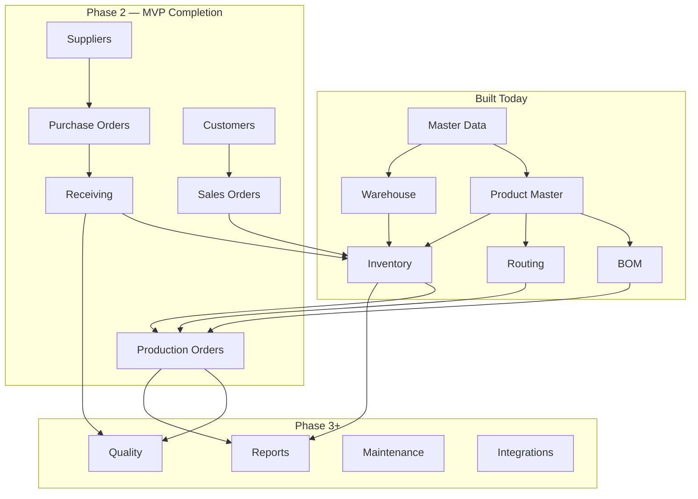

# 04 — Modules

Feature-by-feature status for every module in ProductVA. Status reflects **what a paying customer can do today**, mapped to market expectations (MES/ERP/WMS).

**Status key:** ✅ Complete · 🔧 Partial · ❌ Missing · ⏳ Planned (Phase 2+)

---

## Authentication & Onboarding

| Feature | Status | Notes |
|---------|--------|-------|
| Login / logout | ✅ | Fortify |
| Registration + org creation | ✅ | Creates default plant |
| Two-factor authentication | ✅ | Fortify |
| Passkeys | ✅ | Fortify |
| Setup wizard | ✅ | `SetupWizardController`, factory readiness checks |
| Post-login redirect to setup when incomplete | ✅ | `LoginResponse` |

---

## Organization & Plants

| Feature | Status | Notes |
|---------|--------|-------|
| Multi-organization (Super Admin) | ✅ | Admin area |
| Plant CRUD | ✅ | |
| Default plant per org | ✅ | |
| Plant switcher | ✅ | `plant-dropdown.tsx` |
| Plant deletion guard | ✅ | `PlantDeletionGuardTest` |
| Hide inactive plants from switcher | ❌ | |
| Inter-plant stock transfer | ❌ | Roadmap Phase 3 |

---

## Users, Roles & Permissions

| Feature | Status | Notes |
|---------|--------|-------|
| Organization users | ✅ | Link user ↔ employee |
| Role assignment | ✅ | Spatie permissions |
| Permission middleware on routes | ✅ | |
| Menu visibility by permission | ✅ | `app-sidebar.tsx` |
| Audit log UI | ❌ | Permission stub only |
| Employee profile (Overview, Assignments, Permissions) | ✅ | Dashboard-style profile |

---

## HR — Departments, Employees, Shifts

| Feature | Status | Notes |
|---------|--------|-------|
| Departments CRUD | ✅ | Delete blocked when in use |
| Employees CRUD | ✅ | Code, plant, manager, personal fields |
| Employee bulk activate/deactivate/archive | ✅ | |
| Inactive employee login block | ✅ | |
| Inactive excluded from assignable pickers | ✅ | |
| Reporting manager hierarchy | ✅ | Cycle detection implemented |
| Shifts CRUD | ✅ | Color field |
| Shift overlap validation | ❌ | |

---

## Plant Resources — Work Centers, Machines, Operations

| Feature | Status | Notes |
|---------|--------|-------|
| Work centers | ✅ | Plant-scoped |
| Machines | ✅ | Linked to work center |
| Operations master | ✅ | Reusable operation definitions |
| Maintenance module | ❌ | Permissions only |
| Machine downtime tracking | ❌ | |

---

## Product Master

| Feature | Status | Notes |
|---------|--------|-------|
| Product CRUD (types, pricing, dimensions) | ✅ | |
| SKU / barcode uniqueness | ✅ | |
| Categories (hierarchical) | ✅ | Delete guards, name uniqueness |
| Units of measure | ✅ | Code + name uniqueness |
| Lot / serial / expiry flags | 🔧 | Not enforced on stock moves |
| Track inventory toggle | ✅ | Clears stock fields when off |
| Stock min / safety / reorder / max validation | ✅ | Hierarchy enforced |
| Opening stock & cost fields | 🔧 | Stored; does not post ledger |
| Default warehouse | ✅ | |
| Attachments (datasheet, drawings) | ✅ | |
| Product list filters (warehouse, manufacturer, brand, UOM) | ✅ | |
| Bulk activate / deactivate / category / warehouse / delete / export | ✅ | |
| CSV import | 🔧 | Validation errors; no failed-row export |
| CSV export | ✅ | |
| Product variants | ❌ | |
| Bundles / kits | ❌ | |
| Supplier link | ❌ | No supplier master |

---

## Bill of Materials

| Feature | Status | Notes |
|---------|--------|-------|
| BOM CRUD | ✅ | |
| Versioning & effectivity dates | 🔧 | Dates stored; auto-obsolete not enforced |
| Default BOM per product | ✅ | |
| Copy BOM | ✅ | |
| Circular BOM prevention | ✅ | `BomService` |
| Duplicate line prevention | ✅ | |
| Phantom explosion | ❌ | |
| Where-used report | ❌ | Gap M-01 |
| Cost rollup | ❌ | Gap M-02 |
| BOM used in production guard | ⏳ | Needs production orders |

---

## Routings

| Feature | Status | Notes |
|---------|--------|-------|
| Routing CRUD | ✅ | Plant-scoped |
| Operation sequence & times | ✅ | |
| Release / obsolete lifecycle | ✅ | Released = locked |
| Default routing per product/plant | ✅ | |
| Copy routing | ✅ | |
| Alternate routings | ❌ | |
| Labour cost rollup | ❌ | Gap M-03 |

---

## Warehouse Management

| Feature | Status | Notes |
|---------|--------|-------|
| Warehouse types | ✅ | |
| Warehouses | ✅ | Default flag, negative stock flag |
| Warehouse locations (bins) | ✅ | Hierarchy, unique code per warehouse |
| Delete warehouse with stock guard | ❌ | Stub |
| Delete location with stock guard | ❌ | |
| Default receiving/picking bins | ❌ | |

---

## Inventory

| Feature | Status | Notes |
|---------|--------|-------|
| Inventory balances by product/location | ✅ | |
| Stock adjustment | ✅ | Creates ledger entry |
| Stock transfer (location / warehouse) | ✅ | Paired TRF transactions |
| Transaction ledger (read-only) | ✅ | |
| Negative stock prevention | ✅ | Product + warehouse flags |
| Available = on-hand − reserved | ✅ | |
| Reservation workflow | ❌ | Field exists; always 0 |
| Lot/serial enforcement | ❌ | |
| Cycle count | ❌ | Roadmap Phase 3 |

---

## Procurement & Receiving

| Feature | Status | Notes |
|---------|--------|-------|
| Supplier master | ❌ | Blocker H-01 |
| Purchase orders | ❌ | Blocker B-03 |
| PO approval flow | ⏳ | |
| Goods receipt (GRN) | ⏳ | |
| ASN | ⏳ | |
| Over-receipt / partial receipt | ⏳ | |

---

## Sales & Dispatch

| Feature | Status | Notes |
|---------|--------|-------|
| Customer master | ❌ | Blocker H-02 |
| Sales orders | ❌ | Blocker B-04 |
| Pick / pack / ship | ⏳ | |
| Delivery notes | ⏳ | |

---

## Production (MES Core)

| Feature | Status | Notes |
|---------|--------|-------|
| Production / work orders | ❌ | Blocker B-01 |
| Material allocation & issue | ⏳ | |
| Shop floor reporting (start/pause/complete) | ⏳ | |
| Scrap / rework / yield | ⏳ | |
| WIP movement | ⏳ | |
| Backflush | ⏳ | |

---

## Quality

| Feature | Status | Notes |
|---------|--------|-------|
| Inspection plans | ❌ | Blocker H-03 |
| Incoming / in-process / final QC | ⏳ | |
| NCR / CAPA | ⏳ | |
| Quarantine hold on stock | ⏳ | |

---

## Planning & Scheduling

| Feature | Status | Notes |
|---------|--------|-------|
| Production scheduling | ⏳ | |
| Capacity planning | ⏳ | |
| Material availability (MRP) | ⏳ | |
| Shift planning integration | 🔧 | Shifts exist; no scheduler |

---

## Dashboard & Reports

| Feature | Status | Notes |
|---------|--------|-------|
| Operational dashboard KPIs | ❌ | Blocker B-02 |
| Inventory valuation report | ❌ | Blocker H-05 |
| Stock movement report | ❌ | Ledger UI only |
| Production / OEE / scrap reports | ⏳ | |
| Report export (PDF/Excel) | ❌ | |

---

## Notifications & Integrations

| Feature | Status | Notes |
|---------|--------|-------|
| In-app notifications | ❌ | Gap H-07 |
| Email alerts | ❌ | |
| Barcode scanner integration | ⏳ | |
| Label printers | ⏳ | |
| ERP / accounting sync | ⏳ | |
| Webhooks / API retries | ⏳ | |

---

## Admin & Platform

| Feature | Status | Notes |
|---------|--------|-------|
| Super Admin dashboard | 🔧 | Placeholder |
| Roles & permissions management | ✅ | |
| Soft-delete aware unique codes | ✅ | Across masters |

---

## Module Dependency Graph

See [06-roadmap.md](./06-roadmap.md) for sprint plan and [07-business-rules.md](./07-business-rules.md) for rule-level detail.
